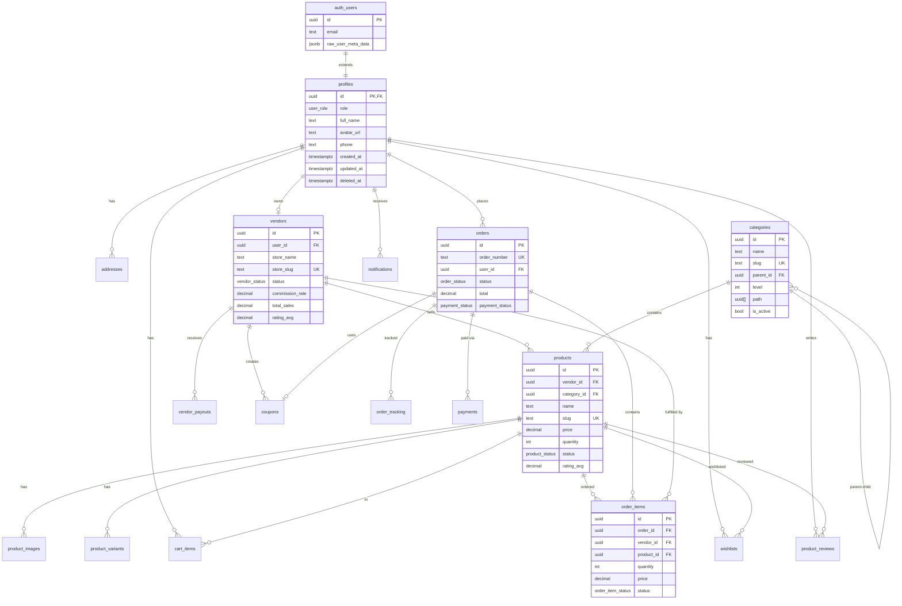

# B_Kart Database Documentation

Comprehensive database documentation for the B_Kart multi-vendor marketplace platform.

## Overview

B_Kart uses PostgreSQL 15+ via Supabase with:
- Row Level Security (RLS) for access control
- UUID primary keys for all tables
- Audit columns (created_at, updated_at, created_by, updated_by)
- Soft delete support (deleted_at)
- Optimized indexes for performance

## Directory Structure

```
db/
├── README.md              # This file
├── schema.sql             # Legacy schema (kept for reference)
├── functions.sql          # Legacy functions (kept for reference)
├── rls_policies.sql       # Legacy RLS policies (kept for reference)
├── schemas/
│   └── 00_core_schema.sql # Complete schema with improvements
├── policies/
│   └── 01_rls_policies.sql # Row Level Security policies
├── functions/
│   └── 02_business_functions.sql # Business logic functions
├── views/
│   └── 03_views.sql       # Database views
├── migrations/
│   ├── up/                # Forward migrations
│   └── down/              # Rollback migrations
└── seeds/
    └── 00_seed_data.sql   # Development seed data
```

## Setup Instructions

### Prerequisites

1. Supabase project created
2. Access to SQL Editor in Supabase Dashboard
3. PostgreSQL client (optional, for CLI access)

### Initial Setup

Run the following files **in order** in Supabase SQL Editor:

```bash
# 1. Create migration tracking (if not exists)
db/migrations/up/00000000000000_migration_tracking.sql

# 2. Create schema (tables, indexes, constraints)
db/schemas/00_core_schema.sql

# 3. Create RLS policies
db/policies/01_rls_policies.sql

# 4. Create business functions
db/functions/02_business_functions.sql

# 5. Create views
db/views/03_views.sql

# 6. Load seed data (development only)
db/seeds/00_seed_data.sql
```

### Using Supabase CLI

```bash
# Run a specific migration
supabase db execute --file db/schemas/00_core_schema.sql

# Run seed data
supabase db execute --file db/seeds/00_seed_data.sql
```

## Entity Relationship Diagram



## Tables Reference

### Core Tables

| Table | Description | RLS Enabled |
|-------|-------------|-------------|
| `profiles` | User profiles (extends auth.users) | ✅ |
| `addresses` | User shipping/billing addresses | ✅ |
| `vendors` | Vendor store information | ✅ |
| `categories` | Product categories (hierarchical) | ✅ |
| `products` | Product catalog | ✅ |
| `product_images` | Product images | ✅ |
| `product_variants` | Product variants (size, color) | ✅ |

### Commerce Tables

| Table | Description | RLS Enabled |
|-------|-------------|-------------|
| `cart_items` | Shopping cart items | ✅ |
| `coupons` | Discount coupons | ✅ |
| `orders` | Customer orders | ✅ |
| `order_items` | Order line items (per vendor) | ✅ |
| `order_tracking` | Shipment tracking events | ✅ |
| `payments` | Payment transactions | ✅ |
| `vendor_payouts` | Vendor payout records | ✅ |

### Engagement Tables

| Table | Description | RLS Enabled |
|-------|-------------|-------------|
| `product_reviews` | Customer reviews | ✅ |
| `wishlists` | User wishlists | ✅ |
| `notifications` | User notifications | ✅ |

### System Tables

| Table | Description | RLS Enabled |
|-------|-------------|-------------|
| `platform_settings` | Configuration key-value pairs | ✅ |
| `audit_log` | Change tracking (optional) | ✅ |
| `_migrations` | Migration tracking | ❌ |

## Naming Conventions

### Tables
- **snake_case** for table names
- Singular nouns (exception: `order_items`, `cart_items`)
- Prefix with entity for junction tables (e.g., `product_images`)

### Columns
- **snake_case** for column names
- `id` for primary keys (UUID)
- `_id` suffix for foreign keys
- `is_` prefix for booleans
- `_at` suffix for timestamps
- `_count` suffix for counters
- `_avg` suffix for averages

### Indexes
- `idx_<table>_<column>` for single column
- `idx_<table>_<col1>_<col2>` for composite

### Constraints
- `<table>_<column>_check` for CHECK constraints
- `<table>_<column>_unique` for UNIQUE (if not using index)

### Enums
- **snake_case** for enum type names
- Descriptive lowercase values

## Common Queries

### Get active products with vendor info
```sql
SELECT * FROM v_product_listings
WHERE status = 'active'
ORDER BY created_at DESC
LIMIT 20;
```

### Search products
```sql
SELECT * FROM search_products(
  'wireless earbuds',  -- search query
  NULL,                -- category filter
  NULL,                -- vendor filter
  0,                   -- min price
  200,                 -- max price
  4.0,                 -- min rating
  20,                  -- limit
  0                    -- offset
);
```

### Get vendor dashboard stats
```sql
SELECT * FROM get_vendor_dashboard_stats('vendor-uuid-here');
```

### Get order summary
```sql
SELECT * FROM v_order_summary
WHERE user_id = auth.uid()
ORDER BY created_at DESC;
```

### Get category tree
```sql
SELECT * FROM v_category_tree
WHERE is_active = true
ORDER BY path;
```

### Get low stock products
```sql
SELECT * FROM get_low_stock_products('vendor-uuid-here');
```

## RLS Policy Summary

| Role | profiles | vendors | products | orders | order_items |
|------|----------|---------|----------|--------|-------------|
| anon | SELECT (public) | SELECT (approved) | SELECT (active) | ❌ | ❌ |
| customer | CRUD (own) | SELECT (approved) | SELECT (active) | CRUD (own) | SELECT/INSERT (own) |
| vendor | CRUD (own) | CRUD (own) | CRUD (own) | SELECT (related) | SELECT/UPDATE (own items) |
| admin | ALL | ALL | ALL | ALL | ALL |

## Triggers

| Trigger | Table | Event | Function |
|---------|-------|-------|----------|
| `on_auth_user_created` | `auth.users` | INSERT | `handle_new_user()` |
| `set_order_number_trigger` | `orders` | INSERT | `set_order_number()` |
| `calculate_commission_trigger` | `order_items` | INSERT | `calculate_commission()` |
| `decrease_inventory_on_order` | `order_items` | INSERT | `decrease_inventory()` |
| `restore_inventory_on_cancel` | `order_items` | UPDATE | `restore_inventory()` |
| `update_product_rating_*` | `product_reviews` | INSERT/UPDATE/DELETE | `update_product_rating()` |
| `update_vendor_rating_trigger` | `products` | UPDATE | `update_vendor_rating()` |
| `update_vendor_sales_trigger` | `orders` | UPDATE | `update_vendor_sales()` |
| `notify_order_status_trigger` | `orders` | UPDATE | `notify_order_status_change()` |
| `notify_vendor_*` | `order_items`/`vendors` | INSERT/UPDATE | Notification functions |
| `update_*_updated_at` | All with updated_at | UPDATE | `update_updated_at_column()` |

## Troubleshooting

### Error: "type already exists"
```sql
-- Types are created with IF NOT EXISTS, but if you need to recreate:
DROP TYPE IF EXISTS user_role CASCADE;
-- Then re-run schema
```

### Error: "policy already exists"
```sql
-- Policies are dropped before recreation. If issues persist:
DROP POLICY IF EXISTS "policy_name" ON table_name;
```

### Error: "profile not found after signup"
Check that the `on_auth_user_created` trigger exists:
```sql
SELECT * FROM pg_trigger WHERE tgname = 'on_auth_user_created';
```

### Performance Issues
1. Check that indexes exist: `\di` in psql
2. Analyze tables: `ANALYZE table_name;`
3. Check query plans: `EXPLAIN ANALYZE SELECT ...;`

### RLS Blocking Access
Test policies with:
```sql
SET ROLE authenticated;
SET request.jwt.claims.sub = 'user-uuid-here';
SELECT * FROM table_name;
RESET ROLE;
```

## Migration Guide

### Creating a New Migration

1. Create files with timestamp prefix:
   ```
   YYYYMMDDHHMMSS_description.sql
   ```

2. Add up migration in `migrations/up/`
3. Add down migration in `migrations/down/`
4. Make migrations idempotent (can run multiple times)

### Example Migration

```sql
-- migrations/up/20241201120000_add_product_weight.sql
DO $$
BEGIN
  IF NOT migration_applied('20241201120000_add_product_weight') THEN
    ALTER TABLE products ADD COLUMN IF NOT EXISTS weight_kg DECIMAL(8,2);
    PERFORM record_migration('20241201120000_add_product_weight');
  END IF;
END $$;
```

```sql
-- migrations/down/20241201120000_add_product_weight.sql
ALTER TABLE products DROP COLUMN IF EXISTS weight_kg;
SELECT remove_migration('20241201120000_add_product_weight');
```

## Best Practices

1. **Always use transactions** for multi-statement operations
2. **Test RLS policies** after making changes
3. **Use views** for complex queries to simplify application code
4. **Add indexes** for columns used in WHERE, JOIN, ORDER BY
5. **Soft delete** sensitive data (use `deleted_at`)
6. **Audit sensitive changes** using `audit_log` table
7. **Keep migrations small** and focused on one change
8. **Document schema changes** in migration comments

## Resources

- [Supabase Documentation](https://supabase.com/docs)
- [PostgreSQL Documentation](https://www.postgresql.org/docs/)
- [Row Level Security](https://supabase.com/docs/guides/auth/row-level-security)
